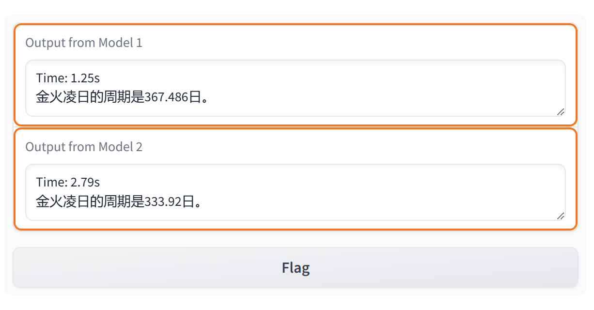

# 实验报告

##### 计36班 郑皓之 2023012168


**注：模型分析报告已融入“预训练效果“”微调效果”“模型效果分析”三节中，故不再单独提供模型分析报告**

**另注：为避免报告篇幅过长，本文主要涉及核心方法及重点思路，具体实现详见源代码，在此不过多赘述。**


## 项目结构

```
.
├── config   # 预训练和微调的参数设置
│   ├── train_config.py
│   └── train_config_sft.py
├── configurator.py
├── data   # 数据处理
│   ├── prepare.py
│   └── prepare_sft.py
├── data_utils.py   # 构造预训练与微调阶段要输入模型的数据
├── evaluations-RougeL.py   # Rouge-L 评估
├── evaluations-perplexity.py   # Perplex 评估
├── examples.csv   # 预设prompts方便客户端快速选择测试
├── model.py
├── sample.py
├── sample_gradio.py   # gradio客户端连接本地模型&远程api实现竞技场web
├── server.py   # flask服务端挂载api接口
├── sft   # 生成sft
│   ├── sft_generate.py   # 调用本地部署的qwen2模型挂载的api进行批量sft生成
│   └── sft_saves.jsonl   # 生成的sft-QA数据集
├── train.py
└── visualize.py   # loss曲线可视化生成
```


## 预训练数据处理（./data/prepare.py）

​		在所有操作开始之前，我将关键的一些变量全部转移到 config 中的 train_config.py 中储存，方便不同程序间达成统一，利于项目管理，代码如下：

```Python
# sys.path.append(os.path.abspath(os.path.join(os.path.dirname(__file__), '..')))   # 二级目录需要通过此行重定向
from config.train_config import block_size
from config.train_config import EOT_TOKEN
from config.train_config import PAD_TOKEN
```

​		在 prepare.py 中，通过二进制读写与 os.walk 遍历方法，灵活处理指定文件夹下的所有 jsonl 文件，方便拓展数据规模：

```Python
data_chunk = ""
for root, dirs, files in os.walk(directory):
    print(f"Currently in directory: {root}")
    for file in files:
        file_path = os.path.join(root, file)
        print(f"Processing file: {file_path}")
        with open(file_path, 'r', encoding='utf-8') as f:
            for line_cnt, line in enumerate(f, start=1):
                # if line_cnt % 100 == 0:
                #     print(f"Line {line_cnt}")
                json_line = json.loads(line)
                text = clean_text(json_line["text"])   # 数据清洗确保质量
                process_data(text, train_file, val_file)
                data_chunk = ""   # 每个文件提交一次
```

​		在大作业初期，我选用的是将全部词条收尾拼接在一起的方法，但经过预训练后得到的效果差强人意。经过同学讨论与咨询助教，特做出了如下几点改变:

​		1、wiki 词条一一对应切分出的 block（截断或补全），并在 data_utils.py 中通过 numpy 的 reshape 方法确保每个 block 被完整取出，随机选取。由此成功避免了词条全部拼接 + ix索引随机选取进而导致的大概率首位句被截断或不同 wiki 词条混搭。

​		代码过多在此略过，具体实现详见 ./data/prepare.py 与 ./data_utils.py。

​		2、通过对“。”的搜索与匹配保证了在新的处理方法中，截断后获得的仍然是结束到“。”的中文整句，由此让预训练模型更容易学习到“句”的概念。考虑到未超过 block_size 的中文字段在经过 gpt-2 编码器后 token 数量仍有可能超过 block_size ，故选择先编码“。”，在整个 wiki 词条的 text 部分编码后匹配并截断，由此避免截断后仍然超过 block_size 的情况发生。（截断后用<EOT>标记段落结束）

```Python
token_ids = enc.encode_ordinary(data_chunk)
eot_encoded = enc.encode_ordinary("。") # 编码“。”用于匹配

last_period_idx = block_size
for i in range(block_size, -1, -1): # 最长可能性为block_size, 后向前寻找
    if i == 0: # 若无“。”则放弃本条数据
        return
    if token_ids[i:i + len(eot_encoded)] == eot_encoded and i + len(eot_encoded) < block_size:
        last_period_idx = i + len(eot_encoded) # 若寻找到, 则结束标记指向该“。”位置
        break

token_ids = token_ids[:last_period_idx] # 截取到最后一个“。”
```

​		3、通过对 block_count 进行计数，方便后续 epoch 数量的计算与指定。

​		4、对每条wiki词条的内容进行数据清洗，排除数据中常见的几种无效信息，避免模型学习这些不正确的 pattern（在没有进行清洗时预训练后时常出现“（）”但括号中为空的情况）：

```Python
def clean_text(text):
    newline_idx = text.find("\n\n")
    if newline_idx != -1:
        text = text[newline_idx+2:]
    else:
        text = text
    meaningless = set({"\n", '（）', '()', '「」', '（；）', '（，）', '《》', '“”', r'-{}-', "<div>"}) # /n later
    for pattern in meaningless:
        text = re.sub(re.escape(pattern), '', text)   # 通过正则表达式去除wiki词条中的无效字段
    return text
```

​		至此，预训练数据处理基本完成，获得两个位于 ./data/processed/ 中的 train.bin 与 val.bin 文件，等待下一步预训练使用。


## 预训练数据准备（./data_utils.py）

​		由于修改了预训练的处理形式，以 wiki 词条为单位提前划分了 block，故需要重新对 data_utils.py 中的预训练数据准备做出对应调整，主要调整了数据的读取方式，确保读取后得到的是准备好的完整 block，并对这些 block 做随即索引而非对全部数据进行随即索引：

```Python
def init_data_pretrain(dataset):
    global train_data, val_data
    
    data_dir = os.path.join('data', dataset)
    train_data_path = os.path.join(data_dir, 'train.bin')
    val_data_path = os.path.join(data_dir,'val.bin')

    # train_data = np.memmap(os.path.join(data_dir, 'train.bin'), dtype=np.uint16, mode='r')
    # val_data = np.memmap(os.path.join(data_dir, 'val.bin'), dtype=np.uint16, mode='r')
    train_data = np.fromfile(train_data_path, dtype=np.uint16).reshape(-1,block_size)
    val_data = np.fromfile(val_data_path, dtype=np.uint16).reshape(-1,block_size)   # memmap改为fromfile方法并通过reshape保证读入后block的完整性
```

```Python
def get_batch_pretrain(split, batch_size, block_size, device):
    ...
	ix = torch.randint(0, len(data), (batch_size,))   # 对准备好的block进行随机选取
    ...
```

​		此外，因为大部分 wiki 词条经过预训练数据处理截断后不足 block_size，需要通过提前标记的<EOT>来对 loss_mask 进行正确标记，实现代码如下：

```Python
loss_mask = torch.ones_like(x, dtype=torch.float64)
loss_mask[y == EOT_TOKEN] = 0   # 全部EOT的loss_mask置0
eot_positions = (y == EOT_TOKEN).nonzero(as_tuple=True)
for batch_idx, token_idx in zip(*eot_positions):
    if token_idx < loss_mask.size(1):
        loss_mask[batch_idx, token_idx:] = 0   # 将全部EOT_TOKEN及以后的loss_mask置0
```

​		**特别的**，在源代码中，我也实现了一种对 train.bin 进行**遍历**的方法，取消随机选取的特性，尝试对比随机选取对顺序选取对大模型训练效果产生的影响。在尝试不同组合后发现：随机选取相比遍历选取的预训练模型性能显著更高。具体代码参见 ./data_utils.py，通过 if_trav 可切换随机/遍历的数据准备形式。


## 预训练效果

​		在实验初期尝试时，首先使用的仅为 wiki-zh-subset-train_subset.jsonl 中的数据，但尝试过后效果不佳。故尝试拓展至全部提供的数据集进行预训练（即全14个文件）。此措施取得了较为出色的效果，在仅仅提供wiki词条首句作为提示时即可达到非常出色的补全效果。下为两例（temp=0.1, top_k=20, max_new_tokens=225, block_size=512）：


​		当然，也有部分补充效果不好，会发生重复的问题，在提高到 temp=0.4 后表现正常（但每次生成存在随机性），解决此问题推测可以通过加大预训练数据量或提高模型规模解决（下图为调整 temp=0.1 与 temp=0.4 的结果对比）：


​		特别的，注意到预训练模型输出的一些数字（如上图中邮政编码）是错误的，推测是由于用于训练的数据中相似数据较多且无显著规律（wiki 词条有非常多火车站的介绍，每个都具有一个邮政编码），预训练模型难以学习。

​		此外，预训练最终采取的参数组合详见 ./config/train_config.py；训练loss曲线可视化详见./visualize.py。

​		至此，成功获得可以正确进行补全的预训练模型，在进行后续尝试时，发现使用更多数据用于预训练能够显著提升微调阶段的收敛效果，故重新使用来自 2020wiki 1.2G数据（https://github.com/CLUEbenchmark/CLUECorpus2020）与本实验提供的全部数据集进行拼接后使用，在此基础上得到新一版的预训练模型用于后续微调。


## 微调数据生成（./sft/sft_generate.py）

​		最初同小组成员一起尝试手写生成，效率过于低下。此后也尝试了“要求+10-30条wiki词条”的形式发送给 Chatgpt-4、GLM-4 等模型协助处理，但我们十分遗憾地发现，目前市面上的大模型对于像这样，多条数据+长文本+同一处理要求的请求，处理效果不尽如人意，而只有在一次处理3-5条wiki词条的时候表现尚可，一次处理1条wiki词条的时候表现最佳。

​		基于此发现，并受此思路启发，我尝试通过 api +脚本的方式完成 sft 数据的生成。首先，由于在线大模型服务提供 api 收费且具有一定不稳定性（网络不佳/封号风险），我在本地部署了离线版本的 Qwen2-7b 模型，并挂载了本地的 api 接口。（本机显卡为4070Ti 12G，通过 LM Studio 完成模型与 api 挂载）：（图为本地挂载的api）


​		通过给出的 api 调用方法，使用脚本的形式对每条wiki词条做同样处理。拼接的固定prompt头如下：

​		*”我现在需要你对json文段中的"text"字段做如下处理：对此文段的关键信息提出3至6个不同的关键问题并给予这些问题相应的回答(一定要源自于原文段而不是你的理解，问题要在原文中有答案），问题不能相同，问题个数根据文段承载信息多少决定。每个问题应当能够独立于文段而被理解，所有问题的设问对象一定是一个明确的主体而非代词或模糊描述。生成的内容格式要求的正则表达式为: {"question": "(.+?)", "answer": "(.+?)"} ,以这样的json形式输出给我，需要严格遵守此格式。不管你生成几对{"question": "", "answer": ""}，问题和答案都应该是一一对应的，一个返回的json中包含一个问题和一个答案。对于我给出的文段，直接返回给我3到6个按要求的形式的json封装。另外要求所有问题的主谓宾明确，不要出现代词或指代词。问题均不超过15字不少于1字，答案均不超过300字不少于1字。下面是文段：“*

​		Qwen2对每个wiki词条的回复，脚本会对其进行合法性检测（是否符合QA对数量要求、是否以规定json形式输出、是否含有非法字符等）。若不满足，则重新生成；若满足，则存入 sft_saves.jsonl 等待下一步处理。根据测试，考虑到错误输出后的重生成，平均对每个 wiki 词条生成三个QA对的时间为1.5s左右。在2天左右的 sft 生成过程中，一共采集到了针对 wiki-zh-subset-train_subset.jsonl 中wiki词条的总计近160000条sft数据。问题质量均得到良好保证。以下为截取生成的部分微调数据：

```json
{"question": "石壁凡塘鳢俗名是什么？", "answer": "石壁美塘鳢是石壁凡塘鳢的俗名。", "id": 749}
{"question": "石壁凡塘鳢分布于哪些海域？", "answer": "石壁凡塘鳢分布于印度西太平洋区，包括斯里兰卡、印度、泰国、菲律宾、印度尼西亚、澳大利亚、密克罗尼西亚、美拉尼西亚、波利尼西亚以及中国南海等海域。", "id": 749}
{"question": "石壁凡塘鳢的模式产地在哪里？", "answer": "石壁凡塘鳢的模式产地在Vanicolo。", "id": 749}
{"question": "描述一下石壁凡塘鳢的体形特征。", "answer": "石壁凡塘鳢体延长呈圆柱状，眼睛突出，腹鳍愈合成吸盘。", "id": 749}
{"question": "红点叶𫚥虎鱼属于什么类型的鱼类？", "answer": "红点叶𫚥虎鱼属于暖水性沿岸鱼类。", "id": 750}
{"question": "红点叶𫚥虎鱼主要栖息于哪种环境中？", "answer": "红点叶𫚥虎鱼多见于珊瑚丛中。", "id": 750}
{"question": "眼带叶𫚥虎鱼属于哪个科？", "answer": "眼带叶𫚥虎鱼属的鱼类，为亚热带海水鱼，分布于西北太平洋琉球群岛、小笠原群岛、西沙群岛等，属于暖水性鱼类。其常见于珊瑚丛中，为一夫一妻制，生活习性不明。", "id": 751}
{"question": "眼带叶𫚥虎鱼的分布区域包括哪些？", "answer": "眼带叶𫚥虎鱼分布于西北太平洋琉球群岛、小笠原群岛、西沙群岛等。", "id": 751}
```

​		以下为本次 api 请求方法：

```python
completion = client.chat.completions.create(
        model="Qwen/Qwen2-7B-Instruct-GGUF",
        messages=[
            {"role": "system", "content": system_content},
            {"role": "assistant", "content": inputs}
        ],
        temperature=0.45,
    ) # 向api发送请求
```

​		脚本详见 ./sft/sft_generate.py。


## 微调数据处理（./data/prepare_sft.py）

​		微调数据处理大体和预训练数据处理相似，每个问答也通过了<EOT>和<PAD>进行了截断补全，不同的是在问题与答案之间增加了固定的"##"作为分隔符（<A>），其经过 gpt-2 编码器后得到固定 id=2235，利于模型理解并区分问答。

```Python
def process_line(line):
    json_line = json.loads(line)
    q = json_line["question"]
    a = json_line["answer"]   # 从sft生成阶段得到的json中提取QA对
    qa = enc.encode(f"{q}") + [A_TOKEN] + enc.encode(f"{a}") + [EOT_TOKEN]   # 提取QA对并与<A>和<EOT>拼接
    if len(qa) > block_size:   # 长度检测
        return None
    elif (len(qa) == block_size):
        return qa
    else:
        qa += [PAD_TOKEN] * (block_size - len(qa))
        return qa
```

​		其余部分与预训练数据近似，此略，详见./data/prepare_sft.py。


## 微调数据准备（./data_utils.py）

​		微调数据准备基本同预训练数据准备，通过在微调数据处理时划分block，并通过 Numpy 的 reshape 方法读取确保每个QA对作为一个完整的block参与训练。不同点在于，loss_mask需要标记<EOT>为1以此让模型学会终止（之后的<PAD>标记为0），同时，<A>及以前的位置的loss_mask均需标记为0。此操作便于实现。

```Python
loss_mask[y == EOT_TOKEN] = 1   # 需要模型学会<EOT>终止
    eot_positions = (y == EOT_TOKEN).nonzero(as_tuple=True)
    for batch_idx, token_idx in zip(*eot_positions):
        if token_idx < loss_mask.size(1):
            loss_mask[batch_idx, token_idx:] = 0   # <EOT>之后置0

    loss_mask[y == A_TOKEN] = 0   # <A>之前的问题不需要作为答案的一部分
    a_token_positions = (y == A_TOKEN).nonzero(as_tuple=True)
    for batch_idx, token_idx in zip(*a_token_positions):
        if token_idx < loss_mask.size(1):
            loss_mask[batch_idx, :token_idx + 1] = 0   # <A>之前置0
```

​		具体代码参见 ./data_utils.py。


## 微调效果

​		在高质量sft数据的加持下，得到的微调后的模型的问答效果高度可用。具体样例如下：


​		当然，对于训练以外的问题，模型的回答便不尽如人意。如线下验收时的其中一个问题：


​		通过调整temp=0.2，有概率得到接近正确答案的输出：


​		由此不难看出，当前模型的问答泛化能力仍然有待加强，推测可能是sft数据过多产生一定程度的过拟合（图像中未显示），或是模型规模有待扩大/预训练数据多元性与数量有待加强。

​		此外，微调最终采取的参数组合详见 ./config/train_config_sft.py。


## Gradio & Flask 客户端与服务端（./sample_gradio.py & ./server.py）

​		竞技场的实现依托于基于Gradio实现的客户端与基于Flask实现的服务端，分别位于./sample_gradio.py与./server.py。**由于内容较多且无过多技术难点在此略述。**

​		值得注意的是，gradio 与 flask 均通过 yield 方法取代 return 方法，成功实现了打字机效果。

​		此外，通过对<EOT>的扫描与对“##"的探测，保证了返回的答案中不会包括问题本身，且在遇到终止<EOT>后即刻停止返回。

```Python
if not torch.equal(idx[:, -1:], idx_next):
    idx = torch.cat((idx, idx_next), dim=1)
    output_tokens = idx[0].tolist()
    try:
        end_idx = output_tokens.index(50256)   # 终止符扫描
        output_tokens = output_tokens[:end_idx]
    except:
        output = decode(output_tokens)
        if("##" in output):   # 对问题进行划分后, 保证答案不包括问题自身
            output = output.split("##")[1]
        yield output
    yield decode(output_tokens)
```

​		同时，通过对与解码后中文被截断导致的特殊无意义字符进行替换，避免生成时总是弹出“�“标识。

```Python
yield outputs.replace("�", "")
```

​		我在 Gradio 客户端集成了单人Chatbot与多人竞技场，可以在此测试单个模型效果，也可以让多个模型进行PK（可以选择提前预设好的他人api）：


​		其中 Gradio 客户端挂载在7860端口，Flask 服务端挂载在5000端口，同一内网下可以相互通过对方 ip 的响应端口访问 api：

```Python
	"# 郑皓之LAPTOP": "192.168.194.164:5000",
	"# 郑皓之 PC": "192.168.194.139:5000",
    "# 詹晓宇": "192.168.194.181:5000",
    "# 陈禹默": "192.168.194.32:5000",   # api预设, 连接到他人api
```

​		验收时，我们使用了 ZeroTier 第三方服务，其提供内网穿透、远程内网组建、内网地址重映射的功能。小组成员通过 ZeroTier 构建远程内网，**保证了不在同一局域网内仍然可以通过远程内网的固定ip地址访问到他人的 api 接口。**


## 模型效果分析（./evaluations-perplexity.py&./evaluations-RougeL.py）

​		此处选用拥有较高代表性的一预训练模型与一微调模型进行效果分析：

​		预训练：不难发现，在预训练过程中，初期 loss 下降迅速，后期趋于稳定。其中 Training Loss 因采样点较多呈现震荡下降的曲线。在另一训练了超20w次的过拟合预训练模型中，Validation Loss 并未呈现单调递减曲线，而是在某一最低点后向上递增，推测此点之后发生过拟合现象。其Perplexity困惑度为2.3，Rouge-L在部分表现较好的文段可以达到0.75，在另一些表现不好的文段则只能达到0.2左右。（下图均为该预训练模型，而非用于对比的过拟合模型，相较之下，过拟合模型的Perplexity为2.5，Rouge-L表现相近）


​				Pretrain-Perplexity

```bash
PS E:\Code\Codefield\Python\ML\MiniGPT> & C:/Users/HaozhiZheng/AppData/Local/Programs/Python/Python310/python.exe e:/Code/Codefield/Python/ML/MiniGPT/evaluations-perplexity.py
number of parameters: 123.59M
e:\Code\Codefield\Python\ML\MiniGPT\model.py:55: UserWarning: 1Torch was not compiled with flash attention. (Triggered internally at ..\aten\src\ATen\native\transformers\cuda\sdp_utils.cpp:455.)
  y = torch.nn.functional.scaled_dot_product_attention(q, k, v, attn_mask=None, dropout_p=self.dropout if self.training else 0, is_causal=True)
Perplexity: 2.3040283585175265
```

​				Pretrain-Rouge-L

```
PS E:\Code\Codefield\Python\ML\MiniGPT> & C:/Users/HaozhiZheng/AppData/Local/Programs/Python/Python310/python.exe e:/Code/Codefield/Python/ML/MiniGPT/evaluations-RougeL.py
number of parameters: 123.59M
e:\Code\Codefield\Python\ML\MiniGPT\model.py:55: UserWarning: 1Torch was not compiled with flash attention. (Triggered internally at ..\aten\src\ATen\native\transformers\cuda\sdp_utils.cpp:455.)
  y = torch.nn.functional.scaled_dot_product_attention(q, k, v, attn_mask=None, dropout_p=self.dropout if self.training else 0, is_causal=True)
--------------------------------------
Question: 金星凌日是当金星运行到太阳和火星之间
Answer: 发生的一种罕见的天文现象。当金星凌日出现，从火星上可以看到金星像一个黑色圆盘从太阳表面划过。上次火星上的金星凌日发生在1998年8月21日。金火凌日的周期是333.92日，它是运用公式1/(1/P-1/Q)运算，其中P(金星)的轨道周期是224.701日，而Q(火星)的轨道周期是686.98日。
Prediction: 时，看见金星横越过太阳前方时，从北极星、火星上可以看到。金星凌日每年皇太子晚上7时30分，从北极星上可以看到。这个日子每隔日将 大约是5天，最多时间可以看到20次。这个日子最初是北极星的一部份，后来改为南极星。在这个日子，水星横越过太阳前方，从北极星、火星、火星、�  
Rouge-L:  0.2027701522335912
--------------------------------------
Question: 周士庄站位于山西省大同市大同县聚乐乡，
Answer: 邮政编码037305，建于1911年，是京包铁路大张段的一个车站。离北京站366公里，离包头站466公里。距上行车站阳高站41公里，距下行车站大同东站11公里。该站隶属太原铁路局大同铁路分局。办理客运业务（旅客乘降，行李、包裹托运）和货运业务（办理整车，不办理危险货物发到），为四等车站，本站及相邻上下行区间均为电气化区段。
Prediction: 邮政编码037305，建于1911年，是京包铁路大张段的一个车站。离北京站387公里，离包头站445公里。距上行车站大同站9公里，距下行车站 大同站9公里。该站隶属太原铁路局大同铁路分局。办理客运业务（旅客乘降，行李、包裹托运）和货运业务（办理整车，不办理危险货
Rouge-L:  0.7534975772879273
--------------------------------------
Question: 一氧化锰是锰的一种氧化物，化学式
Answer: MnO，在自然界中以罕见的方锰矿形式存在。一氧化锰可由氢气还原锰的高价氧化物得到，如：商业上用氢气、一氧化碳或甲烷还原二氧化锰制得 ：一氧化锰也可由碳酸锰的热分解制得：一氧化锰不溶于水，是一种碱性氧化物，溶于酸形成锰(II)盐。一氧化锰有着与氯化钠晶体相同的结构，而一氧化锰的组成可由MnO变化到MnO。118 K以下时，一氧化锰具有反铁磁性。一氧化锰在1951年被发现，其由中子衍射决定其磁性。
Prediction: 为MnO。它是锰最常见的氧化物，也是最重要的化合物之一。一氧化锰可以由锰和氧化锰在高温下反应得到：一氧化锰是白色的，在高温下可 以被氧化为黄色的单质。它在空气中易风化，在空气中易风化。一氧化锰可以和水反应生成氢氧化锰和碳酸锰。一氧化锰可以和碱反应生成相�
Rouge-L:  0.22366391075596342
```

​		微调：微调过程中反复出现的一个现象是：loss在最初骤降，但往往在第二次到第四次 validation test 时发生反弹，后继续逐渐走低，且 Training Loss 比 Validation Loss 的下降速度快。此时曲线相较预训练阶段明显波动更大。选用的微调模型的Perplexity困惑度为1.33，结合测试的其他预训练-微调模型，微调模型的Perplexity困惑度均低于预训练模型，推测由于微调后问答的答案往往是短句，不确定性较小，故困惑都相对更小。Rouge-L在部分表现较好的文段甚至可以达到1.0，表现不佳的也有0.5左右，充分体现了微调后回答的针对性与准确率的提升，并且反映出哪怕询问没有经过预训练的知识点，虽然回答错误，但回答的句式与逻辑是契合提问的问题的。


​				SFT-Perplexity

```bash
PS E:\Code\Codefield\Python\ML\MiniGPT> & C:/Users/HaozhiZheng/AppData/Local/Programs/Python/Python310/python.exe e:/Code/Codefield/Python/ML/MiniGPT/evaluations-perplexity.py
number of parameters: 123.59M
e:\Code\Codefield\Python\ML\MiniGPT\model.py:55: UserWarning: 1Torch was not compiled with flash attention. (Triggered internally at ..\aten\src\ATen\native\transformers\cuda\sdp_utils.cpp:455.)
  y = torch.nn.functional.scaled_dot_product_attention(q, k, v, attn_mask=None, dropout_p=self.dropout if self.training else 0, is_causal=True)
Perplexity: 1.3318065444614657
```

​				SFT-Rouge-L

```bash
PS E:\Code\Codefield\Python\ML\MiniGPT> & C:/Users/HaozhiZheng/AppData/Local/Programs/Python/Python310/python.exe e:/Code/Codefield/Python/ML/MiniGPT/evaluations-RougeL.py
number of parameters: 123.59M
e:\Code\Codefield\Python\ML\MiniGPT\model.py:55: UserWarning: 1Torch was not compiled with flash attention. (Triggered internally at ..\aten\src\ATen\native\transformers\cuda\sdp_utils.cpp:455.)
  y = torch.nn.functional.scaled_dot_product_attention(q, k, v, attn_mask=None, dropout_p=self.dropout if self.training else 0, is_causal=True)
--------------------------------------
Question: 金火凌日的计算公式是？##
Answer: 金火凌日的计算公式为1/(1/P-1/Q)。
Prediction: 使用公式1/(1/P-1/Q)进行计算，其中P和Q分别为金星与火星的轨道周期（686.98日），Q则为海王星的轨道周期（686.98日）。
Rouge-L:  0.6284658040665435
--------------------------------------
Question: 羊侃的字是什么？##
Answer: 羊侃的字是祖忻。
Prediction: 羊侃的字是公祖。
Rouge-L:  0.875
--------------------------------------
Question: 拜仁慕尼黑二队的主场在哪里？##
Answer: 拜仁慕尼黑二队的主场位于慕尼黑的绿森林体育场。
Prediction: 拜仁慕尼黑二队的主场位于慕尼黑的绿森林体育场。
Rouge-L:  1.0
```


​		在不断的尝试中发现，通常而言过拟合会带来负面影响，一组数据基本上通过3-5个epoch即可。由于我生成的sft数量较多（16w条），特尝试了”超级过拟合“的微调模型——即让模型对于所有准备好的sft问题进行超过8个epoch的训练。通过两个模型的对比发现，”超级过拟合“在给定问题的回答上非常笃定且完全正确，但其泛化能力不及正常的微调模型。虽然令人惊讶但是意料之中的是，”超级过拟合“在 temp=1.5 时的回答和 temp=0.1 时的回答完全一致，temp 调节几乎失去作用，也印证了此模型发生了非常严重的过拟合。特别的，”超级过拟合“在普通sft模型非常容易出错的数字上表现极佳。其非常准确地记录了部分词条的相关数值。（如下图，上方为普通sft模型，下方为“超级过拟合”模型，下方答案正确）



​		当然，这只是基于兴趣的实验，在wiki作为基础训练的大模型中表现更佳的代价是泛化能力的极大减弱。在更大模型的训练上，微调数据集也许并不需这么多，为了能够解决更为广泛的问题也不应让模型过拟合。